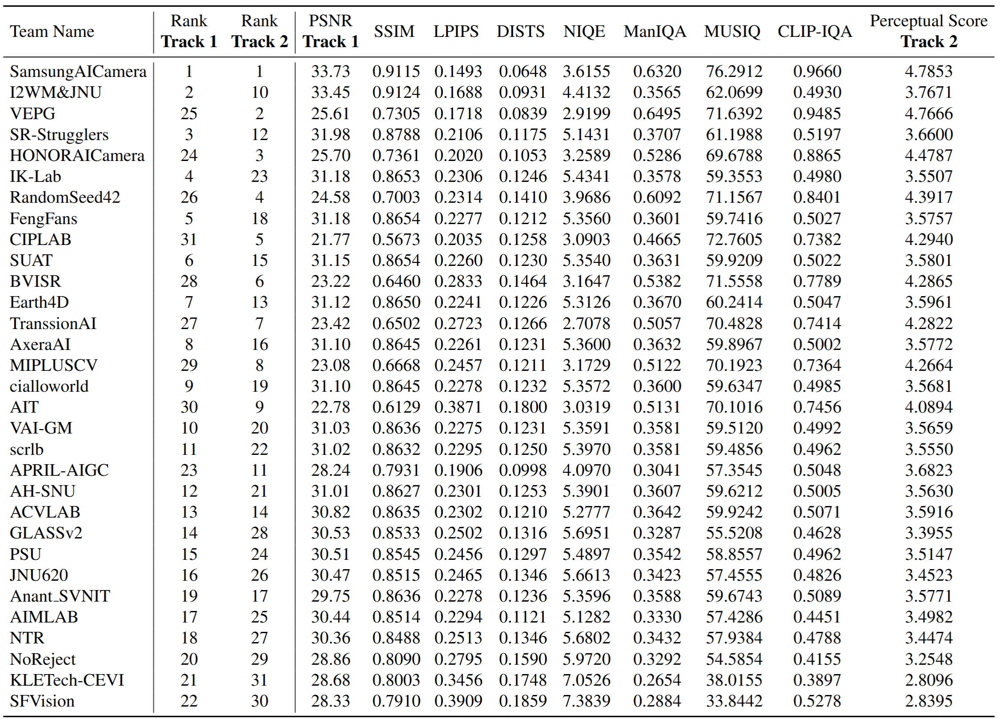

# [NTIRE 2026 Challenge on Image Super-Resolution (×4)](https://cvlai.net/ntire/2026/) @ [CVPR 2026](https://cvpr.thecvf.com/)

[](https://www.cvlai.net/ntire/2026/)
[](https://ntire-sr.github.io/2026)
[](https://openaccess.thecvf.com/content/CVPR2026W/NTIRE/html/Chen_NTIRE_2026_Challenge_on_Image_Super-Resolution_x4_Methods_and_Results_CVPRW_2026_paper.html)
[](https://arxiv.org/abs/2504.xxxxx)
[](https://github.com/zhengchen1999/NTIRE2026_ImageSR_x4/releases/download/Supp/NTIRE.2026.Image.Super.Resolution.x4.Supplementary.pdf)
[](https://github.com/zhengchen1999/NTIRE2026_ImageSR_x4)
[](https://github.com/zhengchen1999/NTIRE2026_ImageSR_x4)

## About the Challenge

The challenge is part of the 11th NTIRE Workshop at CVPR 2026, which targets the classical bicubic down‑sampling setting. Participants should recover a high‑resolution image from a single low‑resolution input that is 4 × smaller.

**Two evaluation tracks.**

1. **Restoration Track:** ranks methods by pixel‑wise accuracy (PSNR).
2. **Perceptual Track:** ranks by a perceptual score that blends several quality metrics: LPIPS, DISTS, NIQE, ManIQA, MUSIQ, and CLIP-IQA.

The dual‑track design encourages solutions that balance fidelity and visual realism, providing a unified benchmark for image super‑resolution models.

## Challenge results

- **31 valid submissions** are ranked.
- **Evaluation set:** all scores are measured on the **DIV2K‑test (100 images)**.
- **Track 1 – Restoration:** Ranked by PSNR (Y channel, 4‑px shave).
- **Track 2 – Perceptual:** Ranked by a combined score: $\text{Score} = \left(1 - \text{LPIPS}\right) + \left(1 - \text{DISTS}\right) + \text{CLIPIQA} + \text{MANIQA} + \frac{\text{MUSIQ}}{100} + \max\left(0, \frac{10 - \text{NIQE}}{10}\right)$.
- **Overall order**: ranking mainly depends on the higher ranking among the two tracks and the average value of the rankings in the two tracks.



## Certificates

**Track 1 – Restoration**
The top three teams by PSNR have received **NTIRE 2026 Image SR (×4) Restoration‑Track certificates**:  

1. SamsungAICamera  
2. I2WM&JNU  
3. SR-Strugglers  

**Track 2 – Perceptual**
The top three teams by Perceptual Score have received **NTIRE 2026 Image SR (×4) Perceptual‑Track certificates**:  

1. SamsungAICamera  
2. VEPG  
3. HONORAICamera  

All certificates can be downloaded from [Google Drive](https://drive.google.com/file/d/xxxxx/view?usp=sharing).

## About this repository

This repository summarizes the solutions submitted by the participants during the challenge. The model script and the pre-trained weight parameters are provided in the [models](./models) and [model_zoo](./model_zoo) folders. Each team is assigned a number according to the submission time of the solution. You can find the correspondence between the number and team in [test.select_model](./test.py). Some participants would like to keep their models confidential. Thus, those models are not included in this repository.

## How to test the model?

1. `git clone https://github.com/zhengchen1999/NTIRE2026_ImageSR_x4.git`
2. Download the model weights from:

    - [Baidu Pan](https://pan.baidu.com/s/xxxxxx?pwd=SRSR) (validation code: **SRSR**)
    - [Google Drive](https://drive.google.com/drive/folders/xxxxx?usp=drive_link)

    Put the downloaded weights in the `./model_zoo` folder.
3. Select the model you would like to test:
    ```bash
    CUDA_VISIBLE_DEVICES=0 python test.py --valid_dir [path to val data dir] --test_dir [path to test data dir] --save_dir [path to your save dir] --model_id 0
    ```
    - You can use either `--valid_dir`, or `--test_dir`, or both of them. Be sure the change the directories `--valid_dir`/`--test_dir` and `--save_dir`.
    - We provide a baseline (team00): DAT (default). Switch models (default is DAT) through commenting the code in [test.py](./test.py#L19).
4. We also provide the output of each team from:

    - [Baidu Pan](https://pan.baidu.com/s/xxxxxx?pwd=SRSR) (validation code: **SRSR**)
    - [Google Drive](https://drive.google.com/drive/folders/xxxxx?usp=drive_link)

    You can directly download the output of each team and evaluate the model using the provided script.
5. Some methods cannot be integrated into our codebase. We provide their instructions in the corresponding folder. If you still fail to test the model, please contact the team leaders. Their contact information is as follows:

| Index |       Team      |            Leader            |              Email              |
|:-----:|:---------------:|:----------------------------:|:-------------------------------:|
|   1   | SamsungAICamera |         Zheng Xie            |     zheng888.xie@samsung.com    |
|   2   |    I2WM&JNU     |         Weijun Yuan          |   yweijun@stu2022.jnu.edu.cn    |
|   3   |      VEPG       |       Fengkai Zhang          |   fengkaizhang@njust.edu.cn     |
|   4   |  SR-Strugglers  |        Shengwei Wang         |    wangshw35@mail2.sysu.edu.cn  |
|   5   | HONORAICamera   |        Yingsi Chen           |    chenyingsi@honor.com         |
|   6   |     IK-Lab      |         Saeed Ahmad          |    saeedahmad@iklab.ai          |
|   7   |  RandomSeed42   |         Kainan Yan           | yankainan24@mails.ucas.ac.cn    |
|   8   |    FengFans     |          Wei Zhou            |       weichow@u.nus.edu         |
|   9   |     CIPLAB      |        Jaeseong Lee          |     jacklee95@naver.com         |
|  10   |      SUAT       |         Yucong Hong          |  SUAT24000175@stu.suat-sz.edu.cn|
|  11   |      BVISR      |        Yuxuan Jiang          |      dd22654@bristol.ac.uk      |
|  12   |     Earth4D     |         Tongyao Mu           |     muty.woodnr@gmail.com       |
|  13   |   TranssionAI   |         Leilei Cao           |   leilei.cao@transsion.com      |
|  14   |     AxeraAI     |       Xiaoping Peng          |  pengxiaoping@axera-tech.com    |
|  15   |    MIPLUSCV     |         Yifei Chen           |       cyf9495@gmail.com         |
|  16   |   cialloworld   |       Xiaoyun Cheng          |  inmtiansuo114514@163.com       |
|  17   |       AIT       |          Yang Ji             |      jiyang@kunbyte.com         |
|  18   |     VAI-GM      |        Nihal Kumar           |   nihkumar@cs.stonybrook.edu    |
|  19   |      scrlb      |       Surya Vashisth         |   prateekshaily820@gmail.com    |
|  20   |   APRIL-AIGC    |         Shijun Shi           |      ssj180123@gmail.com        |
|  21   |     AH-SNU      |         Amitesh M            |   amiteshmahendran@gmail.com    |
|  22   |     ACVLAB      |       Chia-Ming Lee          |    zuw408421476@gmail.com       |
|  23   |     GLASSv2     |        Nishalini K           | nishalinikarthik17@gmail.com    |
|  24   |       PSU       |        Anas M. Ali           |     aaboessa@psu.edu.sa         |
|  25   |     JNU620      |       Shuling Zheng          | zhengshuling@stu2025.jnu.edu.cn |
|  26   |  Anant_SVNIT    |       Nikhil Pathak          |   u24ec012@eced.svnit.ac.in     |
|  27   |     AIMLAB      |       Zhipeng Zhang          | zhangzhipeng22@mails.ucas.ac.cn |
|  28   |       NTR       |         Jiachen Tu           |       jtu9@illinois.edu         |
|  29   |    NoReject     |          Yuqi Li             |    yuqili010602@gmail.com       |
|  30   |  KLETech-CEVI   |      Nikhil Akalwadi         |  nikhil.akalwadi@kletech.ac.in  |
|  31   |    SFVision     |         Yuwen Pan            |     panyw@mail.ustc.edu.cn      |

## How to eval images using IQA metrics?

### Environments

```sh
conda create -n NTIRE-SR python=3.8
conda activate NTIRE-SR
pip install -r requirements.txt
```

### Folder Structure

```
test_dir
├── HR
│   ├── 0901.png
│   ├── 0902.png
│   ├── ...
├── LQ
│   ├── 0901x4.png
│   ├── 0902x4.png
│   ├── ...
    
output_dir
├── 0901x4.png
├── 0902x4.png
├──...

```

### Command to calculate metrics

```sh
python eval.py \
--output_folder "/path/to/your/output_dir" \
--target_folder "/path/to/test_dir/HR" \
--metrics_save_path "./IQA_results" \
--gpu_ids 0 \
```

The `eval.py` file accepts the following 4 parameters:

- `output_folder`: Path where the restored images are saved.
- `target_folder`: Path to the HR images in the `test` dataset. This is used to calculate FR-IQA metrics.
- `metrics_save_path`: Directory where the evaluation metrics will be saved.
- `device`: Computation devices. For multi-GPU setups, use the format `0,1,2,3`.

### Weighted score for Perception Quality Track

We use the following equation to calculate the final weight score: 

$$
\text{Score} = \left(1 - \text{LPIPS}\right) + \left(1 - \text{DISTS}\right) + \text{CLIPIQA} + \text{MANIQA} + \frac{\text{MUSIQ}}{100} + \max\left(0, \frac{10 - \text{NIQE}}{10}\right).
$$

The score is calculated on the averaged IQA scores.

## NTIRE Image SR ×4 Challenge Series

Code repositories and accompanying technical report PDFs for each edition:  

- **NTIRE 2026**: [CODE](https://github.com/zhengchen1999/NTIRE2026_ImageSR_x4) | [PDF](https://arxiv.org/abs/2504.xxxxx)  
- **NTIRE 2025**: [CODE](https://github.com/zhengchen1999/NTIRE2025_ImageSR_x4) | [PDF](https://arxiv.org/pdf/2504.14582)  
- **NTIRE 2024**: [CODE](https://github.com/zhengchen1999/NTIRE2024_ImageSR_x4) | [PDF](https://openaccess.thecvf.com/content/CVPR2024W/NTIRE/papers/Chen_NTIRE_2024_Challenge_on_Image_Super-Resolution_x4_Methods_and_Results_CVPRW_2024_paper.pdf)  
- **NTIRE 2023**: [CODE](https://github.com/zhengchen1999/NTIRE2023_ImageSR_x4) | [PDF](https://openaccess.thecvf.com/content/CVPR2023W/NTIRE/papers/Zhang_NTIRE_2023_Challenge_on_Image_Super-Resolution_x4_Methods_and_Results_CVPRW_2023_paper.pdf)

## Citation

If you find the code helpful in your research or work, please cite the following paper(s).

```
@inproceedings{ntire2023srx4,
  title={NTIRE 2023 challenge on image super-resolution (x4): Methods and results},
  author={Zhang, Yulun and Zhang, Kai and Chen, Zheng and Li, Yawei and Timofte, Radu and others},
  booktitle={CVPRW},
  year={2023}
}

@inproceedings{ntire2024srx4,
  title={Ntire 2024 challenge on image super-resolution (x4): Methods and results},
  author={Chen, Zheng and Wu, Zongwei and Zamfir, Eduard and Zhang, Kai and Zhang, Yulun and Timofte, Radu and others},
  booktitle={CVPRW},
  year={2024}
}

@inproceedings{ntire2025srx4,
  title={NTIRE 2025 Challenge on Image Super-Resolution (x4): Methods and Results},
  author={Chen, Zheng and Liu, Kai and Gong, Jue and Wang, Jingkai and Sun, Lei and Wu, Zongwei and Timofte, Radu and Zhang, Yulun and others},
  booktitle={CVPRW},
  year={2025}
}

@inproceedings{ntire2026srx4,
  title={NTIRE 2026 Challenge on Image Super-Resolution (x4): Methods and Results},
  author={Chen, Zheng and Liu, Kai and Wang, Jingkai and Yan, Xianglong and Li, Jianze and Zhang, Ziqing and Gong, Jue and Li, Jiatong and Sun, Lei and Liu, Xiaoyang and Timofte, Radu and Zhang, Yulun and others},
  booktitle={CVPRW},
  year={2026}
}
```

## License and Acknowledgement
This code repository is release under [MIT License](LICENSE). 
